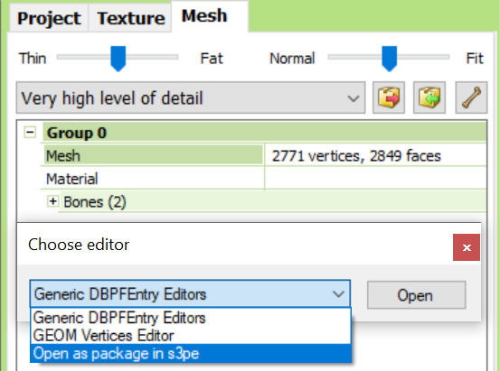
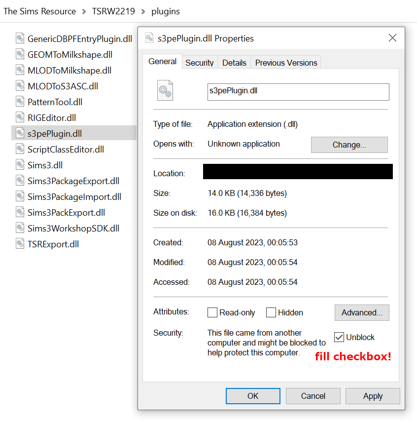

This is an updated s3pe plugin for The Sims Resource Workshop, compatible with TSRW 2.2.114+. Latest version tested is 2.2.119.

The original tool was posted [by Peter at Simlogical](http://simlogical.com/ContentUploadsRemote/uploads/193/index.htm).
My contribution consists in minor changes to make it compatible with newer TSRW versions, as detailed in the changelog.

Usage
=====

The plugin is available in the editor dialog for CASP projects, in the Mesh tab.

The DLL needs to be placed in the TSRW plugin directory, commonly `C:\Program Files (x86)\The Sims Resource\TSR Workshop\plugins`.

Depending on your Windows version, you may encounter issues with DLLs downloaded from the Internet (such as this one).

If `Open as package in s3pe` does not appear in the dropdown, try the following steps:
* in Explorer, select `s3pePlugin.dll` and go to Properties
* if the pictured warning appears under Attributes, fill the `Unblock` checkbox and click `OK`
* reopen TSRW

Changelog
=========

* 0.1.4410.22772 to 0.1.5: added the GameVersion argument to all `DBPF.DBPF` instantiations.
